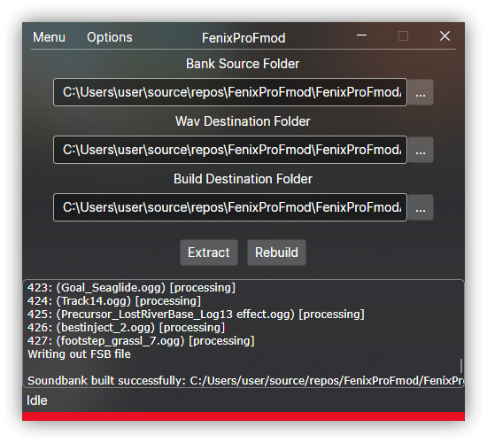

# FenixProFmod

An opensource alternative to Fmod Bank Tools. It can **Extract** and **Rebuild** Fmod Banks. 
Enjoy 20x times faster extraction and 2x times faster bank rebuilding.

It will automatically extract orignal files to its orginal file types. No transcoding to WAV is done. 
- I'll fix the UI asap

Built with love, built with Avalonia.

Tested on game **Subnautica**.

## How to use
- Make sure you have dotnet runtime 8+ installed (https://dotnet.microsoft.com/en-us/download)  

- Move bank files you want to modify/slash extract to bank folder. Click on **Extract** and wait a bit. 

- Extracted sounds are in wav folder.
    - If you want modify some sound files then replace the original with the new one that has the same file type, bitrate etc. **THE DURATION MUST BE SAME OR LESS THAN ORIGINAL AUDIO**

- If you made any changes then pressing rebuild will build new BANK files to bank folder. After that you can move rebuilded banks back to game folder.

# MAKE SURE YOU BACKUP ANY ORIGINAL BANKS YOU WANT TO MODIFY
